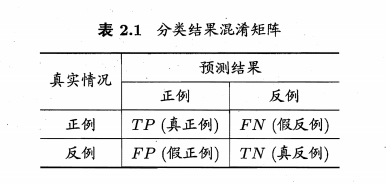
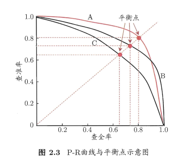
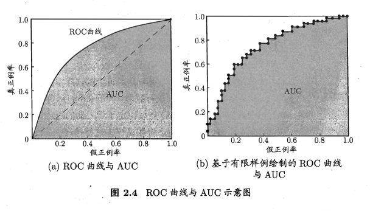

# 性能度量

performance measure, 是衡量模型泛化能力的评价标准，在对比不同模型的能力时，使用不同的性能度量往往会导致不同的评判结果

## 1 常见性能度量

回归任务中常用：均方误差(mean squared error)(MSE)
$$
E(f;D)=\frac{1}{m} \sum^{m}_{i=1}(f(x_i)-y_i)^2
$$
对数据分布$D$和概率密度函数$p(\sdot)$，MSE描述为：
$$
E(f;D)= \int_{x \sim D}(f(x)-y)^2p(x)dx
$$

分类任务中常用：

错误率：
$$
E(f;D)=\frac{1}{m} \sum^m_{i=1}(f(x_i)\ne y_i)
$$
精度：
$$
acc(f;D)=\frac{1}{m} \sum^{m}_{i=1} (f(x_i)=y_i) \\
= 1-E(f;D)
$$
同理，在数据分布D和概率分布$p(\cdot)$中：
$$
E(f;D)= \int_{x \sim D}(f(x) \ne y)p(x)dx \\
acc(f;D) = \int_{x \sim D} (f(x=y))p(x)dx \\
=1-E(f;D)
$$

## 2 查准率/查全率/F1

查准率Positive:
$$
P=\frac{TP}{TP+FP}
$$
查全率Recall:
$$
R= \frac{TP}{TP+FN}
$$

P-R曲线：

平衡点(Break-Event Point, 简称BEP)：是P=R时的取值

BEP过于简化，采用**F1度量**：
$$
\frac{1}{F1} = \frac{1}{2}(\frac{1}{P}+\frac{1}{R}) \\
F1=\frac{2PR}{P+R}= \frac{2 \times TP}{样例总数+TP-TN}
$$
F1度量的一般形式——$F_\beta$ (加权调和平均):
$$
\frac{1}{F_\beta} = \frac{1}{1+\beta^2}(\frac{1}{P}+\frac{\beta^2}{R})
\\
F_\beta = \frac{(1+\beta^2) \times P \times R}{(\beta^2 \times P)+R}
$$

有时候我们会有多个二分类混淆矩阵，在n个二分类混淆矩阵上综合考察查准率和查全率。

宏查准率(macro-P)、宏查全率(macro-R)：

$$
macroP=\frac{1}{n}\sum^n_{i=1}P_i\\macroR=\frac{1}{n}\sum^n_{i=1}R_i\\macroF1=\frac{2*macroP*macroR}{macroP+macroR}
$$

还可将多次混淆矩阵的对应元素进行平均，得到TP、FP、TN、FN的平均值

微查准率(micro-P)、微查全率(micro-R)：

$$
microP=\frac{\overline{TP}}{\overline{TP}+\overline{FP}}\\microR=\frac{\overline{TP}}{\overline{TP}+\overline{FN}}\\microF1=\frac{2*microP*microR}{microP+microR}
$$

## 3 ROC/AUC

ROC（Receiver Operating Characteristic）曲线

纵轴：TPR

横轴：FPR

AUC（Area Under ROC Curve）

ROC曲线下各部分的面积求和

$$
AUC=\frac{1}{2}\displaystyle\sum_{i=1}^{m-1}(x_{i+1}-x_i)\cdot(y_i+y_{i+1})
$$

均方误差(mean squared error)
$$
MSE_{test}=\frac{1}{m}\sum_i{(\hat{y}^{(test)}-y^{(test)})^2_i}
$$