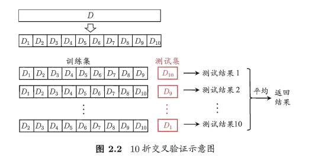

机器学习：在计算机上从数据中产生model的算法(learning algorithm)

# 1 基本术语

data set 数据集

instance/sample 示例/样本

attribute/featrue 属性 特征

attribute value 特征值

attribute space 属性组成的空间（属性空间）

feature vector 特征向量（一个示例）

training set 训练集

training data 训练数据（全部）

training sample 训练样本（单个）

training set 训练集（训练样本组成）

validation set 验证集

hypothesis 潜在规律（假设）

ground-truth 潜在规律自身

learner 模型可称学习器

label

example 拥有标记信息的示例

label space

classification 分类（离散值）

regression 回归（连续值）

supervised learning 监督学习（分类、回归）

unsupervised learning 无监督学习（聚类）

generalization 泛化

induction 归纳

deduction 演绎

NFL（No Free Lunch Theorem）

- 无论学习算法A多聪明、算法B多笨拙，它们的期望性能相同

accuracy 精度

error 误差

overfitting 过拟合

underfitting 欠拟合

sampling 采样

stratified sampling 分层采样

# 2 评估方法

需要对初始数据集进行有效划分，划分出互斥的“训练集”和“测试集”。

## 2.1 留出法

将数据集D划分为两个互斥的集合，一个作为训练集S，一个作为测试集T，满足D=S∪T且S∩T=∅，常见的划分为：大约2/3-4/5的样本用作训练，剩下的用作测试。需要注意的是：训练/测试集的划分要尽可能保持数据分布的一致性，以避免由于分布的差异引入额外的偏差，常见的做法是采取分层抽样。同时，由于划分的随机性，单次的留出法结果往往不够稳定，一般要采用若干次随机划分，重复实验取平均值的做法。

## 2.2 交叉验证法

将数据集D划分为k个大小相同的互斥子集，满足D=D1∪D2∪...∪Dk，Di∩Dj=∅（i≠j），同样地尽可能保持数据分布的一致性，即采用分层抽样的方法获得这些子集。交叉验证法的思想是：每次用k-1个子集的并集作为训练集，余下的那个子集作为测试集，这样就有K种训练集/测试集划分的情况，从而可进行k次训练和测试，最终返回k次测试结果的均值。交叉验证法也称“k折交叉验证”，k最常用的取值是10，下图给出了10折交叉验证的示意图。

## 2.3 自助法

给定包含m个样本的数据集D，每次随机从D 中挑选一个样本，将其拷贝放入D'，然后再将该样本放回初始数据集D 中，使得该样本在下次采样时仍有可能被采到。重复执行m 次，就可以得到了包含m个样本的数据集D'。可以得知在m次采样中，样本始终不被采到的概率取极限为：
$$
\lim_{m \mapsto \infin} (1- \frac{1}{m})^m \longmapsto \frac{1}{e} \approx 0.368
$$
通过自助采样，初始样本集D中大约有36.8%的样本没有出现在D'中，于是可以将D'作为训练集，D-D'作为测试集。自助法在数据集较小，难以有效划分训练集/测试集时很有用，但由于自助法产生的数据集（随机抽样）改变了初始数据集的分布，因此引入了估计偏差。在初始数据集足够时，留出法和交叉验证法更加常用。

## 2.4 调参

大多数学习算法都有些参数(parameter) 需要设定，参数配置不同，学得模型的性能往往有显著差别，这就是通常所说的"参数调节"或简称"调参" (parameter tuning)。

学习算法的很多参数是在实数范围内取值，因此，对每种参数取值都训练出模型来是不可行的。常用的做法是：对每个参数选定一个范围和步长λ，这样使得学习的过程变得可行。例如：假定算法有3 个参数，每个参数仅考虑5 个候选值，这样对每一组训练/测试集就有$5^3=125$ 个模型需考察。

