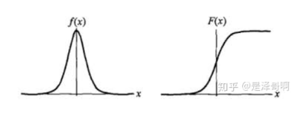
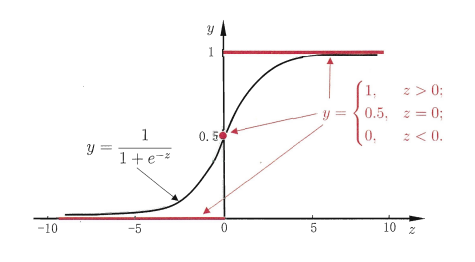

# Logistic Regression

## What is Logistic Regression ?

​	    首先，我们要了解逻辑回归，先来了解一下机器学习的任务。机器学习的任务大致分为两类，一个是**分类**，另一个是**回归**。

​	    **线性回归（Linear Regression）**是回归任务的一种，它是使用函数拟合一条直线，并将数据尽可能地分布在这条直线上，求得直线即数据的变化规律，根据此变化规律，可以用来预测数据。

​		**逻辑回归（Logistic Regression）**,也常叫做对数几率回归，虽然叫回归，但是它常常是用来做分类任务。

### 1.Logistic 分布

​		Logistic分布是一种连续型的概率分布，其分布函数和密度函数分别是：
$$
F(x)=P(X\leqslant x)=\frac 1 {1+e^{-(x-\mu)/\gamma}}\\
f(x)=F'(X\leqslant x)=\frac {e^{{-(x-\mu)}/\gamma}} {\gamma(1+e^{-(x-\mu)/\gamma})^2}
$$
​		其中，$\mu$表示位置参数，$\gamma>0$为位置参数。如下图：

​		在深度学习中常用到的 Sigmoid 函数就是 Logistic 的分布函数在$\mu=0,\gamma=1$ 的特殊形式。

### 2.Logistic 回归

​		已知在线性回归中，我们产生的实际预测$z=w^Tx+b$是实值，而在分类任务中，我们要求的输出值$y\epsilon\{0,1 \}$,它是离散值。最理想的是单位阶跃函数(unit-step function)
$$
y = \begin{cases}
0,\space &z<0\\
0.5,\space &z=0\\
1,\space &z>0
\end{cases}
$$

​		若预测值$z$大于0.5,就判为正例，小于0.5则判为反例，预测值为临界值则可任意判别。如下图红色：

​		又由于单位阶跃函数不连续，无法将其用在广义线性回归的联系函数中，我们采用与其近似程度相似的对数几率回归函数（logistic function），如上图黑色所示，函数为：
$$
y=\frac 1 {1+e^{-z}}
$$
​		从图中可以看出，对数几率函数是一种"sigmoid"函数，将$z$值转化为一个接近0或者1 的$y$值，并且使得其输出值在$z=0$时变化很陡峭，将对数几率函数作为广义线性回归中的联系函数"$g^-(\cdot)$"。将线性回归得到的$z=w^T+b$带入得：
$$
y=\frac 1 {1+e^{w^T+b}}
$$
​		即：
$$
ln\frac y {1-y}=w^T+b
$$
​		我们将$y$视为$x$为正例的概率，$1-y$为$x$为其反例的概率。将两者之间的比值称为**几率（odds）**,取对数则称为**"对数几率（log odds,亦称logit）"**指该事件发生和该事件不发生的概率的比值。这就将回归任务变成了分类任务，其中使用的是广义线性回归的理念，我们通常称其模型为"**对数几率回归**"或"**逻辑回归**"。

​		将$y$视为后验概率估计，重写公式则：
$$
ln\frac {p(y=1\mid x)} {p(y=0\mid x)}=w^T+b
$$
​		显然有：
$$
p(y=1\mid x)=\frac {e^{w^T+b}} {1+e^{w^T+b}}\\
p(y=0\mid x)=\frac {1} {1+e^{w^T+b}}
$$

### 3.Logistic的代价函数		

​		通过极大似然法（maximum likeihood method）来估计$w$和$b$，给定数据集$\{x_i,y_i\}_{i=1}^m$，对率回归模型最大化"对数似然"（log-likeihood）
$$
l(w,b)=\sum_{i=1}^{m}lnp(y_i\mid x_i,b)
$$
​		令每个样本属于真实标记的概率越大越好。便于讨论，令$\beta=(w;b),\hat{x}=x;1$则$w^T+b$可以简写成$\beta^T\hat{x}$,再令$p_1(\hat{x};\beta)=p(y=1\mid\hat{x};\beta),p_0(\hat{x};\beta)=p(y=0\mid\hat{x;\beta})=1-p_1(\hat{x};\beta)$，则上式中的似然项重写为：
$$
p(y_i\mid x_i;w,b)=y_ip_1(\hat{x;\beta})+(1-y_i)p_0(\hat{x};\beta)
$$
​		将上式子带入，并为了方便求解，对等式两边取对数，则代价函数可以重写为：
$$
\begin{align}
l(\beta)&=\sum_{i=1}^m(y_ilnp(x_i)+(1-y_i)ln(1-p(x_i)) \\
&=\sum_{i=1}^{m}(y_iln\frac {p(x_i)} {1-P(x_i)}+ln(1-p(x_i)))  \\
&=\sum_{i=1}^{m}(-y_i\beta^T\hat{x}+ln(1+e^{\beta^T\hat{x_i}}))
\end{align}
$$

​		如果是在整个数据集上去取平均对数似然损失则：
$$
J(\beta)=-\frac 1 N l(\beta)
$$

### 4.求解

​		该代价函数为关于$\beta$的连续可导凸函数，根据经典的数值优化算法等可以求得其最优解，得到求代价函数最小值时的$\beta ^*$如下：
$$
\begin{align}
J(\beta)&=- \frac 1 {n}\sum_{i=1}^m(y_ilnp(x_i)+(1-y_i)ln(1-p(x_i))
\\\beta^*&={\arg \min}\space l(\beta)
\end{align}
$$
​		求解逻辑回归的方法有非常多，这里主要了解一下梯度下降法和牛顿法：

#### （1）随机梯度下降法

​		梯度下降是通过求$J(\beta)$的一阶偏导数来寻找下降方向，并且以迭代的方式来更新参数，更新方式为：
$$
g_i=\frac{\partial J(\beta)} {\partial \beta_i}=(p(x_i)-y_i)x_i\\
\beta _i^{t+1}=\beta_i^t-\alpha g_i
$$
​		其中t为迭代次数，每次参数更新后，可以通过比较$\mid\mid J(\beta^{k+1})-J(\beta^k)\mid\mid$小于阈值或者达到最大迭代次数进行停止迭代。

#### （2）牛顿法

​		牛顿法的基本思路是，在现有极小值的附近对$J(\beta)$ 做二阶泰勒展开，进而找到极小点的下一个估值。
$$
J(\beta)=J(\beta^t)+J'(\beta^t)(\beta-\beta^t)+\frac 1 2 J''(\beta^t)(\beta-\beta^t)
$$
​		令$J'(\beta )=0$，得到$\beta ^{t+1}=\beta^t-\frac{J'(\beta^t)}{J''(\beta^t)}$。因此有迭代更新式：
$$
\begin{align}
\beta^{t+1}&=\beta^t-\frac{J'(\beta^t)}{J''(\beta^t)}\\
&=\beta^t-(\frac {\partial^2J(\beta)} {\partial\beta\partial\beta^T})^{-1}\frac {\partial J(\beta)}{\partial\beta}
\end{align}
$$
​		其中关于$\beta $的一阶、二阶导数为：
$$
\frac {\partial J(\beta)} {\partial\beta}=-\sum_{i=1}^m\hat{x}_i(y_i-p_1(\hat{x_i};\beta))\\
\frac {\partial^2J(\beta) } {\partial\beta\partial\beta^T}=\sum_{i=1}^m\hat{x_i}\hat{x_i}^Tp_1(\hat{x_i;\beta})(1-p_1(\hat{x_i;\beta}))
$$

### Reference

1.https://zhuanlan.zhihu.com/p/74874291

2.《机器学习——周志华》

