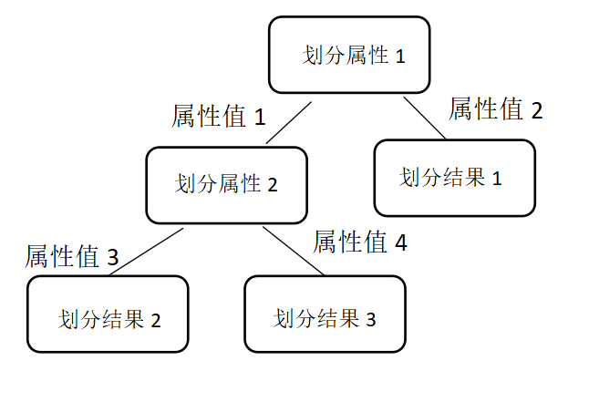

# 决策树

​		决策树是一类常见的机器学习方法，是基于“树”结构进行决策，常用于分类任务。使决策树受到关注，成为机器学习主流技术的算法是ID3（Iterative Dichotomiser 3），而最常用的决策树算法是C4.5，可用于回归任务的决策树算法是CART（Classification and regression Tree）。

## 决策树模型

​		一棵决策树包含一个根结点，若干个内部结点和若干个叶结点。

​		根节点包含样本全集，对应下图中的“划分属性1”这个结点。每个结点对应于一个属性测试，每个结点包含的样本集合根据划分属性的划分结果被划分到子结点中，子结点对应下图中的“划分属性2”这个结点。而图中的“属性值1”和“属性值2 ”为划分“属性1”的两个取值。叶结点对应以决策结果，对应于下图的“划分结果1”、“划分结果2”和“划分结果3”。从根结点到每个叶结点的路径对应了一个判定测试序列。

## 决策树目的

​		为了产生一颗泛化能力强，处理未见示例能力强的决策树，基本流程遵循简单且直观的“分而治之”策略。

### 基本流程

​		学习过程是通过对训练样本的分析来确定“划分属性”，这也是生成一棵决策树的核心。预测过程是将测试示例从根结点开始，沿着划分属性所构成的“判定测试序列”下行，直到叶结点。基本流程是一个自根至叶的递归过程，在每个内部结点中寻找一个划分属性，而如何确定划分属性将是本文的重点。在划分的过程中有三个停止划分的条件：

​	1）当前结点包含的样本全属于同一类别，无需划分；

​	2）当前属性集为空，或是所有样本在所有属性上取值相同，无法划分；

​	3）当前结点包含的样本集合为空，不能划分。

### 属性划分方式

#### ID3算法

​		信息熵（entropy）是度量样本集合“纯度”最常用的一种指标。假定当前样本集合 $D$ 中第 $k$ 类样本所占的比例为$P_k$，其中$|y|$表示样本所能分到类的最大值，则$D$的信息熵定义为：
$$
\text{Ent}(D)=-\sum_{k=1}^{|y|}{p_k\log_2 p_k} \tag{1}
$$

​		若$D_v$表示第$v$个分支结点包含了$D$中在属性$a$上取值为$a_v$ 的样本集合，则以属性$a$对数据集$D$进行划分所获得的信息增益（information gain）为：
$$
\text{Gain}(D,a)=\text{Ent}(D)-\sum_{v=1}^{V}{\frac{|D^v|}{|D|}\text{Ent}(D^v)} \tag{2}
$$
​		信息增益直接以信息熵为基础，计算当前划分对信息熵所造成的变化。在ID3算法中，使用信息增益来作为划分属性的选择标准，信息增益越大，使用属性a来进行划分所获得的“纯度提升”越大。

#### C4.5算法

​		信息增益对可取值数目较多的属性有所偏好，在C4.5算法中进行改进，在该算法中采用增益率来作为选择划分属性的标准，增益率的定义是为：
$$
\text{Gain\_ratio}(D,a)=\frac{\text{Gain}(D,a)}{\text{IV}(a)} \tag{3}
$$
​	 其中$\text{IV}(a)$称为$a$的固有值，其定义式为：

$$
\text{IV}(a)=-\sum_{v=1}^{V}{\frac{|D^v|}{|D|}\log_2\frac{|D^v|}{|D|}} \tag{4}
$$

​		通常，属性$a$的可能取值数目越多 (即$V$越大)，则$\text{IV}(a)$ 的值通常就越大。在C4.5算法中的启发式是先从候选划分属性中找出信息增益高于平均水平的，再从中选取增益率最高的。

#### C5.0算法
​		C5.0算法则是C4.5算法的修订版，适用于处理大数据集，采用Boosting方式提高模型准确率，又称为Boosting Trees，在软件上计算速度比较快，占用的内存资源较少。 

​		C5.0算法选择分支变量的依据：以信息熵的下降速度作为确定最佳分支变量和分割阀值的依据。该算法的核心是信息熵，信息熵的下降意味着信息的不确定性下降。

相较于C4.5算法，C5.0具有以下优点：

​	1）C5.0模型在面对数据遗漏和输入字段很多的问题时非常稳健；

​	2）C5.0模型比一些其他类型的模型易于理解，模型退出的规则有非常直观的解释；

​	3）C5.0也提供强大技术以提高分类的精度。

#### CART算法

​		在CART算法中则使用基尼指数（gini index）来对划分属性进行选择，基尼指数反映了从D中随机抽取两个样例，其类别标记不一致的概率。基尼指数越小，数据集的纯度越高。在候选属性集合中，选取那个使划分后基尼指数最小的属性。

​		以下为基尼指数的表达式：
$$
\text{Gini}(D)=\sum_{k=1}^{|y|}\sum_{k'\not=k}{p_kp_{k'}}=1-\sum_{k=1}^{|y|}p_k^2 \tag{5}
$$
​		其中，$|y|$表示样本所能分到类的最大值。

​		属性$a$的基尼指数：
$$
\text{Gini\_index}(D,a)=\sum_{v=1}^{V}{\frac{|D^v|}{|D|}\text{Gini}(D^v)} \tag{6}
$$

