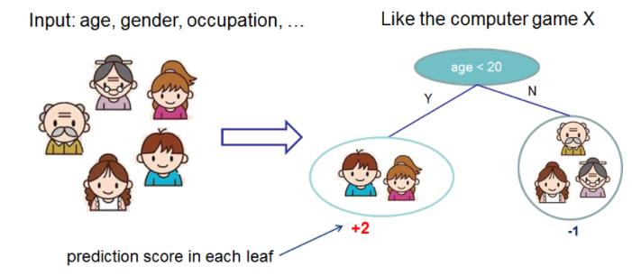
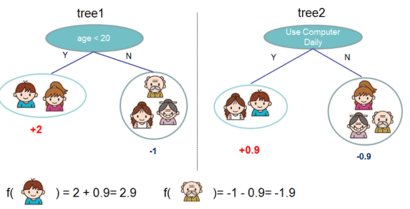
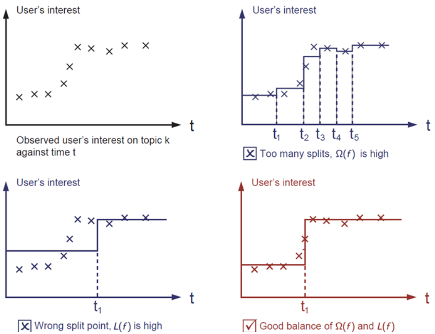
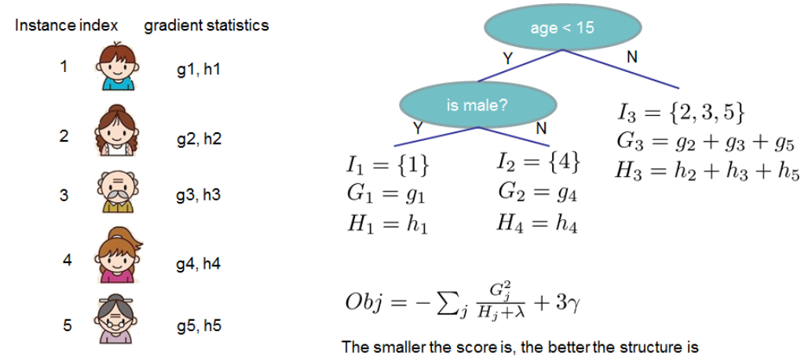

# XGBoost

## Introdution of XGBoost

XGBoost是一个开源机器学习项目，实现了GBDT算法，进行了算法和工程上的许多改进，广泛应用在Kaggle竞赛及许多机器学习竞赛中。说到XGBoost，不得不提GBDT(Gradient Boosting Decision Tree)。XGBoost本质上还是一个GBDT，力争把速度和效率发挥到极致，所以叫X (Extreme) GBoosted。两者都是boosting方法。

下面简单介绍一下XGBoost的应用例子：

利用决策树将下列输入特征，age、gender、occupation,输出标签是一家人对电子游戏的喜好程度，如下图所示

通过训练得出下列两颗树，跟GBDT原理类似，将两棵树结果累加起来就是最终的结论，小孩的分数就是两棵树中所落到小孩节点处的分数相加：2+0.9=2.9.爷爷的预测分是-1+（-0.9）= -1.9，如下图、

## Difference of XGBoost and GBDT

原理上，XGBoost跟GBDT差不多，但是在目标函数的定义上，他们有着较大的区别：

### GBDT算法

（1）初始化弱学习器
$$
f_0(x) = \arg \min_c \sum_{i=1}^N L(y_i,c)
$$

（2）对于$m=1,2,3,\cdots,M$有：

​			（a）对于每个样本$i=1,2,3,\cdots,N$，计算负梯度，即残差
$$
r_{im} = - \bigg[ \frac{\partial L(y_i, f(x_i))}{\partial f(x_i)} \bigg] _{f(x)=f_{m-1}(x)}
$$

​			（b）将上一步得到的残差作为样本的新的真实值，将数据$(x_i,r_{im})$作为下棵树的训练数据，得到一颗新的回归树$f_m(x)$,它对应的叶子节点区域为$R_{jm}，j=1,2,3,\cdots,J，J$为叶子节点的个数

​			（c）对叶子节点计算最佳拟合：
$$
\Upsilon_{jm} = \arg \min \sum_{x_i \in R_{jm}} L(y_i, f_{m-1}(x_i)+ \Upsilon)
$$

​			（d）梯度更新
$$
f_m(x) = f_{m-1}(x) + \sum_{j=1}^J \Upsilon_{jm} I(x \in R_{jm})
$$
（3）迭代M次得出最终结果：
$$
f(x) = f_M(x) = f_0(x) + \sum_{m=1}^M \sum_{j=1}^J \Upsilon_{jm} I(x \in R_{jm})
$$

### XGBoost

首先，普及一下监督学习基础知识，为了训练模型，我们需要定义目标函数来衡量模型与训练数据的拟合程度。目标函数的一个显着特点是它们由两部分组成：训练损失和正则化项：
$$
obj(\theta) = L(\theta) + \Omega(\theta)
$$
其中$L$是训练损失函数，$\Omega$是正则化项。 训练损失衡量我们的模型对训练数据的预测能力。 L 的一个常见选择是均方误差，它由下式给出：
$$
L(\theta) = \sum_i (y_i - \hat{y}_i)^2
$$
另一个常用的损失函数是逻辑损失，用于逻辑回归：
$$
L(\theta) = \sum_i [y_i \ln(1+e^{-\hat{y}_i}) + (1-y_i) \ln (1+e^{\hat{y}_i})]
$$
正则化项是人们通常忘记添加的。 正则化项控制着模型的复杂度，这有助于我们避免过拟合。让我们在下图中考虑以下问题。 给定图像左上角的输入数据点，要求在视觉上拟合阶跃函数。

 一般原则是我们想要一个简单的预测模型。 两者之间的权衡在机器学习中也称为偏差-方差权衡。显然在上图中，最后一个红色的模型是最优的。

在文章开头介绍的实际应用中，我们生成了多棵树，我们将其表示为：
$$
\hat{y}_i = \sum_{k=1}^K f_k(x_i), f_k \in F
$$

其中k代表树的棵数，F是所有可行树的集合，f是该集合空间中的函数，所以目标函数定义为：
$$
obj({\theta})=\sum_i^n l(y_i,\hat y_i) + \sum_k^K \Omega(f_k)
$$
一次性学习所有的树是非常困难的，所以在训练树的过程中，我们使用一种加法策略，修复我们所学的东西，一次添加一颗新树。将步骤t的预测值写为$\hat{y}_i^{(t)}$，然后有：
$$
\begin{align*}
\hat{y}_i^{(0)}&=0\\
\hat{y}_i^{(1)}&=f_1(x_i)=\hat{y}_i^{(0)}\\
\hat{y}_i^{(2)}&=f_1(x_i)+f_2(x_i)=\hat{y}_i^{(1)}+f_2(x_i)\\
\qquad...\\
\hat{y}_i^{(t)}&=\sum_{k=1}^tf_k(x_i)=\hat{y}_i^{(t-1)}+f_t(x_i)
\end{align*}
$$

下面是，每一次我们都需要哪一棵树呢，自然是添加优化我们的目标的那颗树：
$$
\begin{align}
obj^{(t)}&=\sum_{t-1}^nl(y_i,\hat{y}_i^{(t)})+\sum_{t-1}^t\Omega(f_i)\\
&=\sum_{i=1}^nl(y_i,\hat{y}_i^{(t-1)})+f_t(x_i)+\Omega(f_t)+constant
\end{align}
$$
当使用均方损失函数作为损失函数时，将与f(x)无关的项放置到函数末尾，则目标函数变成了
$$
\begin{align}
obj^{(t)}&=\sum_{i=1}^n(y_i-(\hat{y}^{(t-1)}+f_t(x_I)))^2+\sum_{i=1}^t\Omega(f_i)\\
&=\sum_{i=1}^n[2(\hat{y}_i^{(t-1)}-y_i)f_t(x_i)+f_t(x_i)^2]+\Omega(f_t)+constant
\end{align}
$$
将此目标函数进行泰勒展开至二阶：
$$
obj^{(t)}=\sum_{i=1}^n[l(y_i,\hat{y}_i^{(t-1)})+g_if_t(x_i)+\frac1 2h_if_t^2(x_i)]+\Omega(f_t)+constant
$$
gi和hi则定义为：
$$
\begin{align}
g_i&=\partial_{\hat{y}_i^{(t-1)}}l(y_i,\hat{y}_i^{(t-1)})\\
h_i&=\partial_{\hat{y}_i^{(t-1)}}l(y_i,\hat{y}_i^{(t-1)})
\end{align}
$$
我们移动所有常数项到后面：
$$
\sum_{i=1}^n[g_if_t(x_i)+\frac1 2h_if_t^2(x_i)+\Omega(f_t)]
$$
当我们介绍完训练树的步骤时，后面还有一个正则项，我们需要定义树的复杂度。首先定义一个树：
$$
f_t(x)=w_{q(x)},w\in{R^T},q:R^d\to\{1,2,\dotsm,T\}
$$
w代表每个叶子节点的权重，q代表将每个数据分配到每个叶子节点的函数，T是叶子节点的数量，故我们定义复杂度为：
$$
\Omega(f)=\gamma{T}+\frac1 2\gamma\sum_{j=1}^Tw_j^2
$$
定义复杂度的方法不止一种，但是这种方法在实践中比较好，正则化是大多数人经常忽略的一项，这是因为传统树的学习处理只强调改善树的杂质，而复杂性控制则留给启发式。 通过正式定义它，我们可以更好地了解我们正在学习的内容并获得在其他情况表现良好的模型。化简后可以写成：
$$
\begin{align}
obj^{(t)}&\approx\sum_{i=1}^n[g_iw_{q(x_i)}+\frac1 2h_iw_{q(x_I)}^2+\gamma{T}+\frac1 2\gamma\sum_{j=1}^Tw_j^2]\\
&=\sum_{j=1}^T[(\sum_{i\in{I_j}}gi)w_j+\frac1 2(\sum_{i\in{I_j}}h_i+\lambda)w_J^2]+\gamma{T}
\end{align}
$$
进一步压缩得出：
$$
obj^{(t)}=\sum_{j=1}^T[G_jw_j+\frac1 2(H_j+\lambda)w_j^2]+\gamma{T}
$$
其中j是分配给每个数据点的索引，可以看出上式的形式是二次函数的形式，在对称轴处得出最好的目标函数：
$$
\begin{align}
w_j^*&=-\frac{G_j} {H_j+\lambda}\\
obj^*&=-\frac1 2\sum_{j=1}^{T}\frac{G_j^2} {H_j+\lambda}+\gamma{T}
\end{align}
$$
最后一个方程衡量树的结构有多好，比如说：

最后的方程得到的分数越小，说明树的结构越好。如果我们试图将树的某个节点分裂，则我们将用下列式子计算增益：
$$
Gain=\frac1 2\bigg[\frac{G_L^2} {H_L+\lambda}+\frac{G_R^2} {H_R+\lambda}-\frac{(G_L+G_R)^2} {H_L+H_R+\lambda}\bigg]-\gamma
$$
上式子可以分为四部分，分别是分裂后左边叶子节点的分数，分裂后右边叶子节点的分数，以及未分裂时原节点的分数，附加叶子的正则化。当增益小于 $\gamma$时，我们最好选择不分裂此节点。

具体的来说的话，GBDT跟XGBoost的区别是：

1. GBDT是机器学习算法，XGBoost是该算法的工程实现。
2. 在使用CART作为基分类器时，XGBoost显式地加入了正则项来控制模 型的复杂度，防止过拟合，提高模型的泛化能力。
3. GBDT在模型训练时只使用了代价函数的一阶导数信息，XGBoost对代价函数进行二阶泰勒展开，可以同时使用一阶和二阶导数。
4. 传统的GBDT采用CART作为基分类器，XGBoost支持多种类型的基分类器，比如线性分类器。
5. 传统的GBDT在每轮迭代时使用全部的数据，XGBoost则采用了与随机森林相似的策略，支持对数据进行采样。
6. 传统的GBDT没有设计对缺失值进行处理，XGBoost能够自动学习出缺失值的处理策略。

---

**优势：**XGBoost使用了一阶和二阶偏导, 二阶导数有利于梯度下降的更快更准。依靠输入数据的值，进行叶子分裂优化计算, 本质上也就把损失函数的选取和模型算法优化/参数选择分开。这种去耦合增加了XGBoost的适用性，按需选取损失函数, 可以用于分类, 也可以用于回归。

# Reference

1. [终于有人说清楚了--XGBoost算法](https://www.cnblogs.com/mantch/p/11164221.html)
2. [Introduction to Boosted Trees](https://xgboost.readthedocs.io/en/latest/tutorials/model.html)

