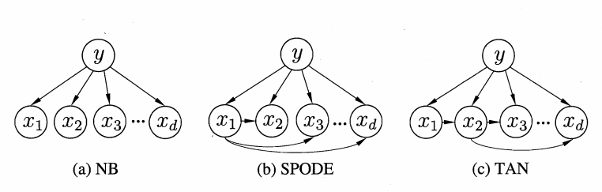
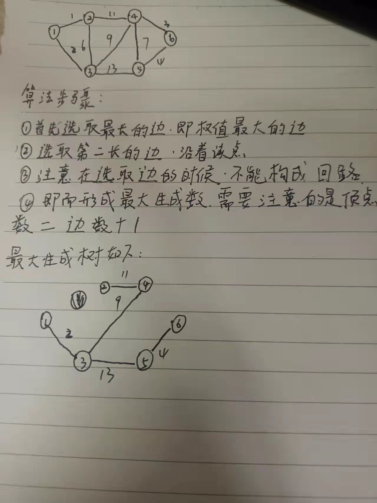
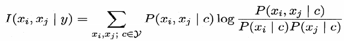
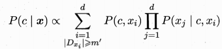
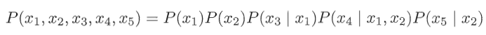
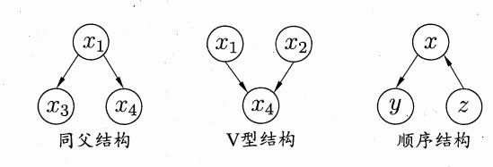
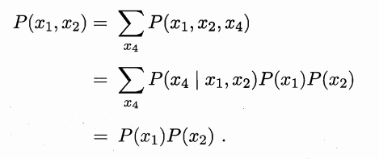
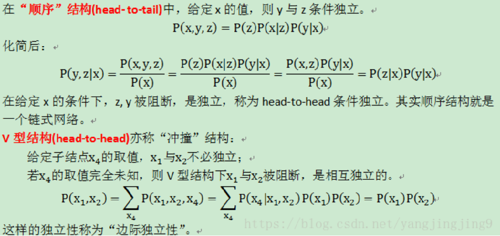

# 7.1贝叶斯决策论

贝叶斯决策论是概率框架下实施决策的基本方法，对分类任务来说，在所有相关概率都已知的理想情形下，贝叶斯决策论考虑如何基于这些概率和误判损失来选择最优的类别标记。

风险(误判损失) = 原本为$c$的样本误分类成$c_j$产生的期望损失，期望损失可通过下式计算：
$$
R(c_i|x)=\sum_{j=1}^{N}{\lambda_{ij}P(c_j|x)}， {\lambda_{ij}}是错误识别产生的损失
$$
个人理解：上面这个式子就是样本$c_1$误认成$c_2$产生的损失，p代表条件概率

为了最小化总体风险，只需在每个样本上选择能够使条件风险$R(c|x)$最小的类别标记。最小化分类错误率的贝叶斯最优分类器为：
$$
h(x)=\arg \min R(c|x)
$$
即对每个样本$x$，选择能使后验概率$P(c|x)$最大的类别标记。

判定准则选择条件：对于每个样本$x$,倘若和能够最小化条件风险，那么总体风险也会达到最小。

利用贝叶斯判定准则来最小化决策风险，首先要获得后验概率$P(c|x)$，机器学习要实现的是基于有限的训练样本集尽可能准确的估计出后验概率$P(c|x)$。

# 7.2 两种模型

采用两种模型的原因：因为在实际应用中，获取后验概率的途径很难，因此使用两种模型获取后验概率。

主要有两种模型：一是“判别式模型”：通过直接建模$P(c|x)$来预测，其中决策树，BP神经网络，支持向量机都属于判别式模型。另外一种是“生成式模型”：通过对联合概率模型$P(x,c)$进行建模，然后再获得$P(c|x)$。对于生成模型来说：

$$
p(c|x)=\frac{p(c,x)}{p(x)}
$$
另外可以通过贝叶斯定理，可以将上面式子写成：
$$
p(c|x)=\frac{p(c)p(x|c)}{p(x)}
$$
上面式子中$p(c)$是类先验概率，$p(x|c)$是类条件概率，$p(x)$是用于归一化的证据因子，对于某一个给定的样本，证据因子与类条件概率无关，这样就可以把估计$p(c|x)$的问题转化为估计先验概率$p(c)$和类条件概率$p(x|c)$的问题上来，而对于后者来说，它是属于关于$x$和$c$的联合概率.

# 7.3 极大似然估计

首先举一个简单的小例子：假如A箱子里面有99个黑球，1个白球，而B箱子里面有99个白球，1个黑球，那么在箱子未知的情况下，抽取到一个黑球，则该箱子大概率是A箱子，这就是极大似然的原理。

假设$p(x|c)$具有确定的形式并且被参数向量唯一确定，则我们的任务是利用训练集估计参数$\theta_c$，将$P(x|c)$记为$P(x| \theta_c)$。令$D_c$表示训练集$D$第$c$类样本的集合，假设样本独立同分布，则参数$\theta_c$对于数据集$D_c$的似然是:
$$
P(D_c|\theta_c)=\prod_{x\in D_c}{P(x|\theta_c)}
$$
对$\theta_c$进行极大似然估计,就是去寻找能最大化似然的参数值$\theta_c$,直观上看，极大似然估计是试图在所有可能的取值中,找到一个能使数据出现的“可能性”最大的值上式的连乘操作易造成下溢，通常使用对数似然:
$$
LL(\theta_c)=\log P(D_c|\theta_c)=\sum{\log P(x|\theta_c)}
$$
此时参数 $\theta_c$的极大似然估计为：
$$
\theta_c=\arg \max LL(\theta_c)
$$
在连续属性情形下，假设概率密度函数，则参数和的似然函数为：
$$
\mu_c=\frac{1}{D_c}\sum_{x\in D_c}x
$$

$$
\delta^2=\frac{1}{D_c}\sum_{x\in D_c}(x-\mu_c)(x-\mu_d)^T
$$

也就是说，通过极大似然法得到的正态分布均值就是样本均值，方差就是 $(x-\mu_c)(x-\mu_d)^T$,在离散情况下，也可通过类似的方式估计类条件概率

注意：这种参数化方法，虽能使类条件概率估计变得相对简单，但估计结果的准确性严重依赖于所假设的概率分布形式是否符合潜在的真实数据分布。在实际应用中，需要考虑应用中的任务中的经验，倘若凭借经验，容易造成错误的结果。

# 7.4 朴素贝叶斯分类器

基于贝叶斯的公式来估计后验概率$p(c|x)$的主要困难在于：条件概率$p(x|c)$是所有属性上的联合概率，难以从有限的训练样本直接估计而得。朴素贝叶斯采用了“属性条件独立性假设”可以避开这个问题，意思是：假设所有属性相互独立，换言之，假设每个属性独立地对分类结果发生影响，基于属性条件独立性假设，贝叶斯的公式可以写成：
$$
P(c|x)=\frac{P(c)P(x|c)}{P(x)}=\frac{P(c)}{P(x)}\prod_{i=1}^{d}{P(x_i|c)}
$$
其中，$d$为属性数目，$x_i$为$x$在第$i$个属性上的取值，另外需要注意的是$x_i$也可以单单就指属性。

由于对于所有的类别$p(x)$相同，因此贝叶斯判定准则有：
$$
h_{nb}=\arg \max _{c\in y}P(c)\prod_{i=1}^{d}P(x_i|c)
$$
这就是朴素贝叶斯分类器的表达式。

显然，朴素贝叶斯分类器的训练过程就是基于训练集$D$来估计类先验概率$p(c)$，并为每个属性估计条件概率$P(x_i|c)$,若$D_c$表示训练集$D$中第$c$类样本组成的集合，若有充足的独立同分布样本，则可容易的估计出来类先验概率：
$$
P(c)=\frac{|D_c|}{D}
$$

对于离散属性而言，$D_c,x_i$表示在第$i$个属性上取值为$x_i$的样本组成的集合，则条件概率$P(x_i|c)$估计为
$$
P(x_i|c)=\frac{|D_{c,x_i}|}{|D_c|}
$$
对于连续属性可考虑为概率密度函数，假定类条件概率的值服从正态分布，则有：
$$
p(x_i|c)=\frac{1}{\sqrt{2\pi}\delta_{c,i}}exp(-\frac{(x_i-x_{c,i})}{2\delta_{c,i}^2})
$$

# 7.5 半朴素贝叶斯分类器

为了降低贝叶斯公式中后验概率$p(c|x)$的困难，朴素贝叶斯采用了属性条件独立性假设，但在现实中这个假设很难成立，由此产生了半朴素贝叶斯分类器的学习方法。顾名思义，这种方法是适当考虑一部分属性间的相互依赖信息，不需要进行完全联合概率计算，也不至于彻底忽略比较强的属性依赖关系。独依赖估计是半朴素贝叶斯分类器最常用的一种策略，就是假设每个属性在类别之外最多依赖于一个其他属性，即
$$
P(c|x)\varpropto P(c)\prod_{i=1}^{d}P(x_i|{c,p_{a_i}})
$$
其中，$p_{a_i}$为属性$x_i$所依赖的属性，称为$x_i$的父属性。此时，对每个属性$x_i$，若其父属性已知，可采用式来估算概率值。现在问题转换为如何确定每个属性的父属性。

假设所有属性都依赖于同一个属性，称为"超父"，然后通过交叉验证等模型选择方法来确定超父属性，由此形成SPODE方法，这里$x_1$是超父属性。
TAN是在最大带权生成树算法的基础上，通过以下步骤生成图c所示的树形结构:

补充知识点：最大带权生成树：

计算任意属性之间的条件互信息:

以属性为结点构建完全图，任意两个结点之间边的权重设为$I(x_i,x_j|y)$，构建此完全图的最大带权生成树，挑选根变量，将边置为有向；加入类别结点$y$，增加从$y$到每个属性的有向边；构建此完全图的最大带权生成树，挑选根变量，将边置为有向；...。可以看出，条件互信息$I(x_i,x_j|y)$刻画了属性$x_i$和$x_j$在已知类别下的相关性，通过最大生成树算法，TAN实际保留了强相关属性之间的依赖性。

AODE是一种基于集成学习机制、更为强大的度依赖分类器。与SPODE通过模型选择超父属性不同，AODE尝试将每个属性作为超父来构建SPODE，然后将那些具有足够训练数据支持的SPODE集成起来作为最终结果,即

与朴素贝叶斯分类器相似，AODE的训练过程也是“计数”，即在训练集上对符合条件的样本继续计数。

# 7.6 贝叶斯网

贝叶斯网也称为信念网,它借助有向无环图来刻画属性之间的依赖关系，并使用条件概率表来描述属性的联合概率分布，具体来说，一个贝叶斯网$B$由结构$G$和参数$\theta$两部分构成，即$B= (G,\theta)$。网络结构$G$是一个有向无环图，其每个结点对应于一个属性，若两个属性有直接依赖关系，则它们由一条边连接起来；参数$\theta$定量描述这种依赖关系，假设属性$x_i$在$G$中的父结点集为$\pi_i$，则$\theta$包含了每个属性的条件概率表示为$\theta_{x_i|\pi_i}=P_B(x_i|\pi_i)$。贝叶斯网结构有效地表达了属性空间的条件独立性。给定父结点集，贝叶斯网假设每个属性与其他属性的元素独立，于是 $B=<G,\theta>$将属性$x_1,x_2,\cdots,x_d$的联合概率分布定义为：

在给定的取值时独立，在给定的取值时独立。

上面的贝叶斯网中三个变量之间的典型依赖关系如下：

在“同父”(common parent)结构中，给定父结点$x_1$的取值,则$x_3$与$x_4$条件独立.在“顺序”结构中，给定$x$的值，则$y$与$z$条件独立。V型结构(V-structure)亦称“冲撞”结构，给定子结点$x_4$的取值,$x_1$与$x_2$必不独立；若$x_4$的取值完全未知，则V型结构下$x_1$与$x_2$却是相互独立的。我们做一个简单的验证:

