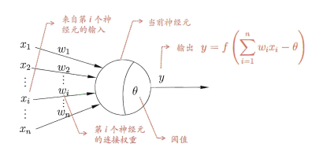
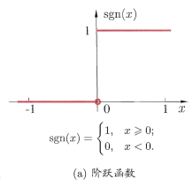
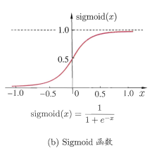
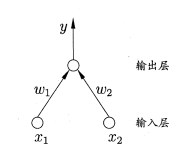
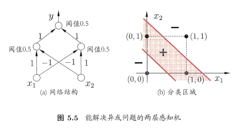
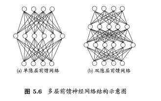
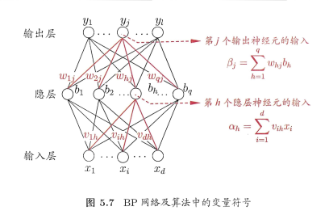

# neural networks

## 神经元(neuron)模型

神经网络最基本的成分

某神经元超过一个“阈值”(threshold)，那么它就会被激活

M-P神经元模型：

通过激活函数(activation function)处理以产生神经元的输出。

理想激活函数：

典型激活函数(Sigmoid)：

## 感知机与多层网络

解决“与”、“或”、“非”模型：

> * “与”：令$w_1=w_2=1,\theta=2$，则$y=f(1\cdot x_1+1 \cdot x_2 -2)$，仅在$x_1=x_2=1$时，$y=1$
> * “或”：令$w_1=w_2=1,\theta=0.5$，则$y=f(1\cdot x_1+1 \cdot x_2 -0.5)$，仅在$x_1=1 \space or \space x_2=1$时，$y=1$
> * "非"：令$w_1=-0.6，w_2=0,\theta=-0.5$，则$y=f(-0.6\cdot x_1+0.5)$，仅在$x_1=1$时，$y=0$；在$x_1=0$时，$y=1$

解决非线性可分问题，考虑使用多层功能神经元。

> 简单的两层感知机解决异或问题

隐含层(hidden layer)：输出层与输入层之间的一层神经元

隐含层、输出层神经元都是拥有激活函数的功能神经元

多层前馈神经网络(multi-layer feedforward neural networks)

> 每层神经元与下一层神经元全互连，神经元之间不存在同层连接，也不存在跨层连接。

## 误差逆传播算法

error BackPropagation,简称BP

训练例$(x_k,y_k)$，假定神经网络的输出为$\hat{y}_j^k=\hat{y}_1^k,\hat{y}_2^k, \dotsb,\hat{y}_l^k$，即
$$
\hat{y}_j^k = f(\beta_j - \theta_j)
$$
在$(x_k,y_k)$上的均方误差：
$$
E_k = \frac{1}{2} \sum_{j=1}^l (\hat{y}_j^k - y_j^k)^2
$$
参数确定数目$(d+l+1)q+l$：输入层到隐层$d \times q$个权值、隐层到输出层$q \times l$个权值、$q$个隐层神经元的阈值、$l$个输出层神经元的阈值

任何参数$v$的更新估计式为：
$$
 v \leftarrow v+ \Delta{v}
$$

BP算法基于梯度下降(gradient descent)策略，以目标的负梯度方向对参数进行调整，有
$$
\Delta{w_{hj}} = - \eta \frac{\partial{E_k}}{\partial{w_{hj}}} \\
\frac{\partial{E_k}}{\partial{w_{hj}}} = \frac{\partial{E_k}}{\partial{\hat{y}_j^k}} \cdot \frac{\partial{\hat{y}_j^k}}{\partial{\beta_j}} \cdot \frac{\partial{\beta_j}}{\partial{w_{hj}}} \\
\frac{\partial{\beta_j}}{\partial{w_{hj}}} = b_h
$$
又Sigmoid函数有一个很好的性质：
$$
f'(x)=f(x)(1-f(x))
$$
于是有：
$$
\begin{equation}
\begin{aligned}
g_j &= -\frac{\partial{E_k}}{\partial{\hat{y}_j^k}} \cdot \frac{\partial{\hat{y}_j^k}}{\partial{\beta_j}} \\
&= -(\hat{y}_j^k - y_j^k) f'(\beta_j - \theta_j) \\
&= \hat{y}_j^k (1- \hat{y}_j^k)(y_j^k - \hat{y}_j^k)
\end{aligned}
\end{equation}
$$
代入以后可得$w_{hj}$的更新公式：
$$
\Delta w_{hj} = \eta g_j b_h
$$
同理可得：
$$
\Delta \theta_j = - \eta g_j \\
\Delta v_{ih} = \eta e_h x_i \\
\Delta \gamma_h = - \eta e_h \\
e_h = - \frac{ \partial{E_k} }{\partial{\beta_j}} \cdot \frac{\partial{b_h}}{\partial{\alpha_h}} =  - \sum_{j=1}^l \frac{\partial{E_k}}{\partial{\beta_j}} \cdot \frac{\partial{\beta_j}}{\partial{b_h}} f'(\alpha_h - \gamma_h) = b_h (1-b_h) \sum_{j=1}^l w_{hj} g_j
$$

BP算法的目标是最小化训练集$D$上的累计误差：
$$
E= \frac{1}{m} \sum_{k=1}^m E_k
$$
基于累计误差最小化的更新规则，就得到了累计误差逆传播(accumulated error backpropagation)算法

> 与标准的BP算法每次更新只针对单个样例，参数更新的非常频繁，往往需进行更多次迭代。但是累积BP算法直接针对累积误差最小化，它在读取整个训练集D一遍后才对参数进行更新，其参数更新频率低，但是在很多任务中，累积误差下降到一定程度后，进一步下降变得很缓慢。这是标准BP会更好，尤其D非常大时。

