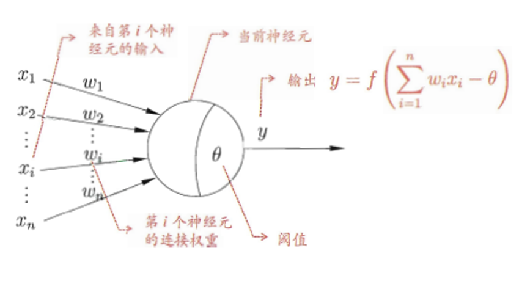
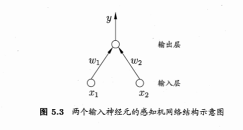
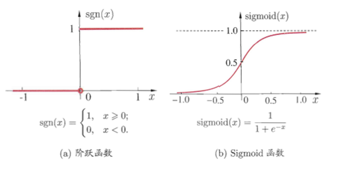
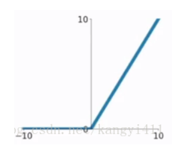
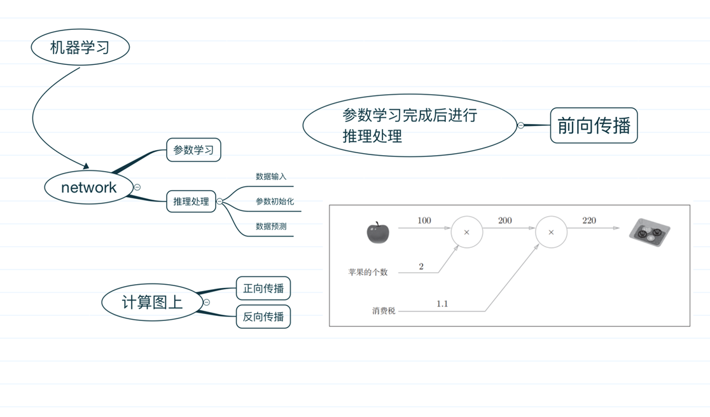
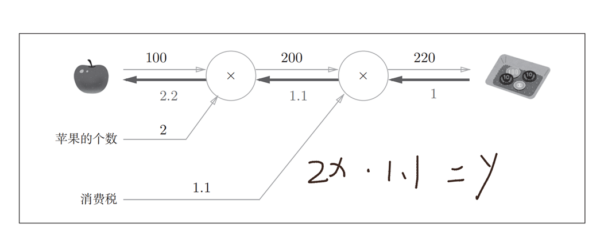
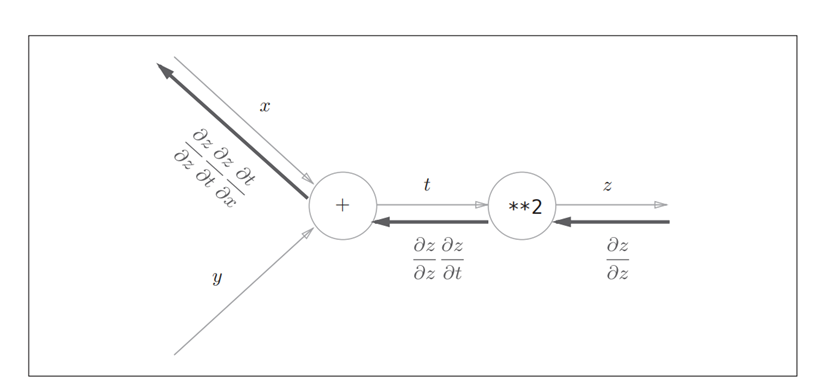
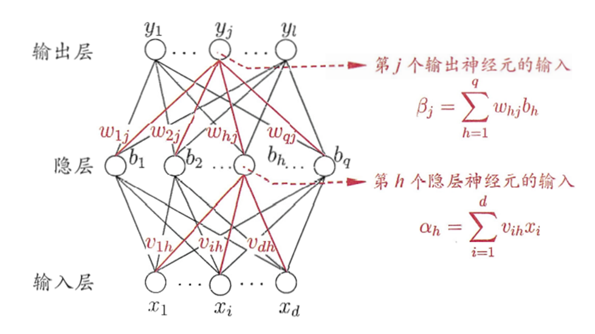

# 神经网络

​		神经网络是一门重要的机器学习技术。它是目前最为火热的研究方向--深度学习的基础。学习神经网络不仅可以让你掌握一门强大的机器学习方法，同时也可以更好地帮助你理解深度学习技术。

​		神经网络是一种模拟人脑的神经网络以期能够实现类人工智能的机器学习技术。人脑中的神经网络是一个非常复杂的组织。成人的大脑中估计有1000亿个神经元之多。

## **一. 前言**

　　首先，先看一下经典的M-P神经元模型：

​		其中有输入、连接权重、神经元、神经元阈值，输出激活函数、输出构成。

​		连接是神经元中最重要的东西。每一个连接上都有一个权重。

　　一个神经网络的训练算法就是让权重的值调整到最佳，以使得整个网络的预测效果最好。
　　我们使用$x_i$来表示输入，用$w_i$来表示权值。一个表示连接的有向箭头可以这样理解：在初端，传递的信号大小仍然是$x_i$，端中间有加权参数$w_i$，经过这个加权后的信号会变成$w_i*x_i$，因此在连接的末端，信号的大小就变成了$w_i*x_i$。$w_i*x_i$跟阈值$\theta$做比较之后，将其输入一个非线性激活函数$f(.)$，然后输出。

​		再让我们来看一个经典的神经网络。这是一个包含三个层次的神经网络。红色的是**输入层**，绿色的是**输出层**，紫色的是**中间层**（也叫**隐藏层**）。输入层有3个输入单元，隐藏层有4个单元，输出层有2个单元。后文中，我们统一使用这种颜色来表达神经网络的结构。

​		有一些知识可以先记在心里：

1. 设计一个神经网络时，输入层与输出层的节点数往往是固定的，中间层则可以自由指定；
2. 神经网络结构图中的拓扑与箭头代表着**预测**过程时数据的流向，跟**训练**时的数据流有一定的区别；
3. 结构图里的关键不是圆圈（代表“神经元”），而是连接线（代表“神经元”之间的连接）。每个连接线对应一个不同的**权重**（其值称为**权值**），这是需要训练得到的。 

​        除了从左到右的形式表达的结构图，还有一种常见的表达形式是从下到上来表示一个神经网络。这时候，输入层在图的最下方。输出层则在图的最上方，如下：

## 二、感知机与神经网络

### 感知机

1.只有输入层和输出层两层神经元，

2.激活函数为信号急剧变化的阶跃函数

### 神经网络

1.有多层神经元，

2.激活函数为平滑变化的Sigmod函数或者ReLU函数

​																		(c)ReLU函数

## 三、神经网络的传播

​		机器学习过程中，可以将过程分为两个部分：参数学习和推理处理。参数学习指进行模型中包含参数的调节变化；推理处理指参数输入、参数初始化、数据预测等。神经网络也适用于此。

​		将在参数学习完成后进行的推理处理叫做**前向传播**。

​		而理解神经网络的方式有两种，一种是通过公式，另一种是通过计算图，下面我们通过计算图来理解一下神经网络：

​		在计算图上，我们将数据的传播分成两种：

​		（1）**正向传播**

​		（2）**反向传播**

​		如下图：

​		每个苹果的价格是100，个数是2，价格乘以个数将其表示为一个乘法节点，输出200，由于交税，再经过一个乘法节点，得到220，然后输出最后要付出的金额。这个由输入到输出的过程叫做**正向传播**。

​		反之，如下图所示，假设苹果价格变动1，交税后变成1.1，最后乘以个数2，得到总金额变化2.2，这个过程反映的在计算题上从后到前的过程是**反向传播**，反向传播过程遵循**链式法则**。

​		**链式法则：**

​		链式法则的**数学表达**：
$$
\frac{\partial{E}_k}{\partial{w_{hj}}}=\frac{\partial{E_k}}{\partial{\hat{y}_j^{k}}}\cdot\frac{\partial{\hat{y}_j^k}}{\partial{\beta}_j}\cdot\frac{\partial{\beta}_j}{\partial{w_{hj}}}
$$

## 四、BP算法简介

​		给定训练集$D=\{(x_1,y_1),(x_2,y_2),...,(x_m,y_m) \},x_i\epsilon{\R^d},y_i\epsilon{\R^l}$，即给定输入示例由$d$个属性描述，输出$l$维实值向量。

​		该神经网络中，所需要求得的参数为各层的权重$w、v$和阈值$\theta、\gamma$，输出层神经元阈值用$\theta $表示，隐层神经元阈值用$\gamma$表示。

​		BP算法基于梯度下降策略，以目标的负梯度方向对参数进行调整。对训练例$(x_k,y_k)$，假设神经网络输出为$\hat{y}^k=(\hat{y_1^k},\hat{y_2^k},...,\hat{y_l^k})$，即
$$
\hat{y_j^k=f(\beta_j-\theta_j)}
$$
​		则网络在$(x_k,y_k)$上的均方误差为
$$
E_k=\frac1 2\sum_{j=1}^l(\hat{y_j^k}-y_j^k)^2
$$
​		根据梯度下降法，假设对参数$w$进行更新，则
$$
\begin{align}
w&\gets w+\triangle{w}\\
\triangle{w_{hj}}&=-\eta\frac{\partial{E_k}} {\partial{w_{hj}}}\\
\frac{\partial{E}_k}{\partial{w_{hj}}}&=\frac{\partial{E_k}}{\partial{\hat{y}_j^{k}}}\cdot\frac{\partial{\hat{y}_j^k}}{\partial{\beta}_j}\cdot\frac{\partial{\beta}_j}{\partial{w_{hj}}}
\end{align}
$$
​		对其他参数更新也是类似的过程。

## 五、多层神经网络（深度学习）

​		在被人摒弃的10年中，有几个学者仍然在坚持研究。这其中的棋手就是加拿大多伦多大学的Geoffery Hinton教授。

　　2006年，Hinton在《Science》和相关期刊上发表了论文，首次提出了“深度信念网络”的概念。与传统的训练方式不同，“深度信念网络”有一个“**预训练**”（pre-training）的过程，这可以方便的让神经网络中的权值找到一个接近最优解的值，之后再使用“**微调**”(fine-tuning)技术来对整个网络进行优化训练。这两个技术的运用大幅度减少了训练多层神经网络的时间。他给多层神经网络相关的学习方法赋予了一个新名词--“**深度学习**”。

 　很快，深度学习在语音识别领域暂露头角。接着，2012年，深度学习技术又在图像识别领域大展拳脚。Hinton与他的学生在ImageNet竞赛中，用多层的卷积神经网络成功地对包含一千类别的一百万张图片进行了训练，取得了分类错误率15%的好成绩，这个成绩比第二名高了近11个百分点，充分证明了多层神经网络识别效果的优越性。

　　在这之后，关于深度神经网络的研究与应用不断涌现。

​		我们延续两层神经网络的方式来设计一个多层神经网络。

　　在两层神经网络的输出层后面，继续添加层次。原来的输出层变成中间层，新加的层次成为新的输出层。所以可以得到下图。

​		与两层层神经网络不同。多层神经网络中的层数增加了很多。

　　增加更多的层次有什么好处？更深入的表示特征，以及更强的函数模拟能力。

　　更深入的表示特征可以这样理解，随着网络的层数增加，每一层对于前一层次的抽象表示更深入。在神经网络中，每一层神经元学习到的是前一层神经元值的更抽象的表示。例如第一个隐藏层学习到的是“边缘”的特征，第二个隐藏层学习到的是由“边缘”组成的“形状”的特征，第三个隐藏层学习到的是由“形状”组成的“图案”的特征，最后的隐藏层学习到的是由“图案”组成的“目标”的特征。通过抽取更抽象的特征来对事物进行区分，从而获得更好的区分与分类能力。

​		从单层神经网络，到两层神经网络，再到多层神经网络，下图说明了，随着网络层数的增加，以及激活函数的调整，神经网络所能拟合的决策分界平面的能力。

​		当然，光有强大的内在能力，并不一定能成功。一个成功的技术与方法，不仅需要内因的作用，还需要时势与环境的配合。神经网络的发展背后的外在原因可以被总结为：更强的计算性能，更多的数据，以及更好的训练方法。只有满足这些条件时，神经网络的函数拟合能力才能得已体现，见下图。

#### 人工智能

​		就普通人看来，这么辛苦的做各种实验，以及投入大量的人力就是为了实现一些不及孩童能力的视觉能力，未免有些不值。但是这只是第一步。虽然计算机需要很大的运算量才能完成一个普通人简单能完成的识图工作，但计算机最大的优势在于并行化与批量推广能力。使用计算机以后，我们可以很轻易地将以前需要人眼去判断的工作交给计算机做，而且几乎没有任何的推广成本。这就具有很大的价值。正如火车刚诞生的时候，有人嘲笑它又笨又重，速度还没有马快。但是很快规模化推广的火车就替代了马车的使用。人工智能也是如此。这也是为什么目前世界上各著名公司以及政府都对此热衷的原因。

　　目前看来，神经网络要想实现人工智能还有很多的路要走，但方向至少是正确的，下面就要看后来者的不断努力了。

# Reference

1.[神经网络——最易懂最清晰的一篇文章_illikang的博客-CSDN博客_神经网络](https://blog.csdn.net/illikang/article/details/82019945?ops_request_misc=%7B%22request%5Fid%22%3A%22163322422616780255246841%22%2C%22scm%22%3A%2220140713.130102334..%22%7D&request_id=163322422616780255246841&biz_id=0&utm_medium=distribute.pc_search_result.none-task-blog-2~all~top_positive~default-1-82019945.pc_search_result_hbase_insert&utm_term=神经网络&spm=1018.2226.3001.4187)

2.[激活函数之ReLU函数_tian_panda的博客-CSDN博客_relu激活函数](https://blog.csdn.net/tian_panda/article/details/82113203)

3.《机器学习——周志华》

