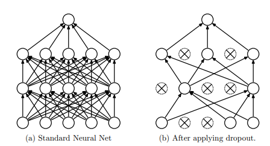
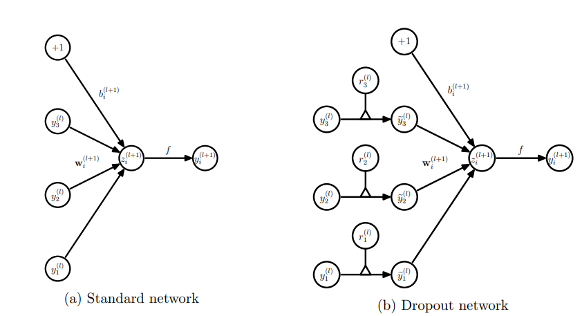

# Dropout

## 原理

神经网络训练过程中，对一次迭代中的某一层神经网络，先随机选择其中的一些神经元并将其临时隐藏（丢弃），然后再进行本次训练和优化。在下一次迭代中，重复以上操作，直至训练结束。

由于是随机丢弃，故而每一个mini-batch都在训练不同的网络。

* 没有dropout的神经网络
  $$
  z_i^{(l+1)} = \bold{w}_i^{(l+1)} \bold{y}^l + b_i^{(l+1)} \\
  y_i^{(l+1)} = f(z_i^{(l+1)})
  $$

* 有dropout的神经网络
  $$
  r_j^{(l)} \sim Bernoulli(p) \\
  \tilde{\bold{y}}^{(l)} = \bold{r}^{(l)} * \bold{y}^{(l)} \\
  z_i^{(l+1)} = \bold{w}_i^{(l+1)} \tilde{\bold{y}}^l + b_i^{(l+1)} \\
  y_i^{(l+1)} = f(z_i^{(l+1)})
  $$

## reference

[paper: ImageNet Classification with Deep Convolutional Neural Networks](https://papers.nips.cc/paper/2012/file/c399862d3b9d6b76c8436e924a68c45b-Paper.pdf)

[paper: Dropout: A Simple Way to Prevent Neural Networks from Overfitting](https://www.cs.toronto.edu/~hinton/absps/JMLRdropout.pdf)

[paper: Improving Neural Networks with Dropout](http://www.cs.toronto.edu/~nitish/msc_thesis.pdf)